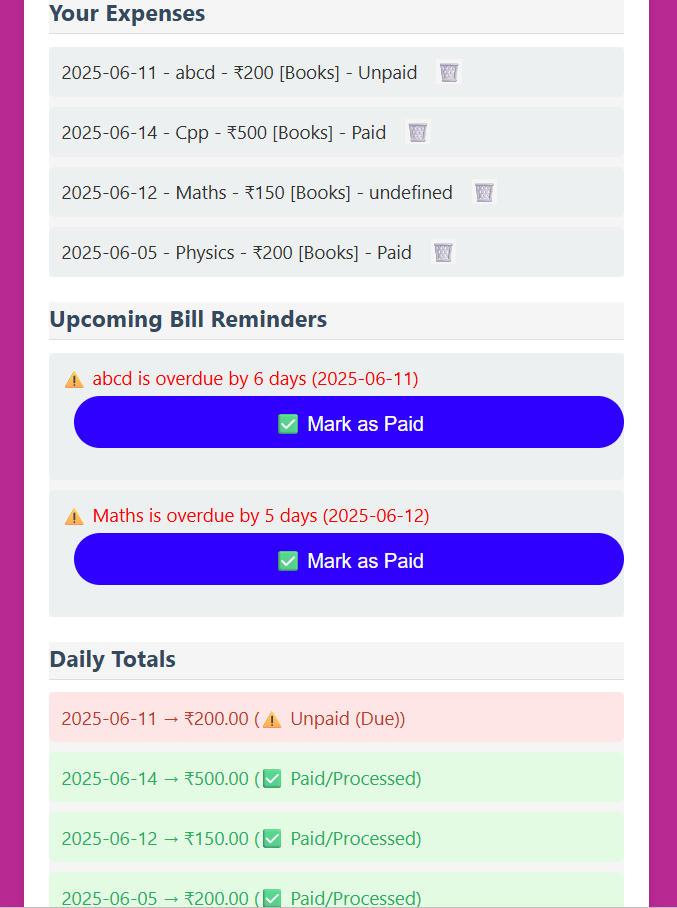

# 💸 Expense Tracker (Firebase + JS)

A simple and smart web-based **expense tracker** with login, real-time cloud storage, daily summaries, and reminder tagging — built using Firebase, HTML, CSS, and JavaScript.

[👉 Live Demo](https://expense-tracker-app-5d84d.web.app)  
[📂 GitHub Repo](https://github.com/Geeta0803/Expense-Tracker)

---

## 🚀 Features

- 🔐 **Firebase Authentication** – Login / Signup system
- 📝 **Add Expenses** – Title, category, amount, date, and status
- ⏳ **Smart Reminders** – Tags unpaid items as “due” or “days left”
- 📊 **Daily Summaries** – Shows total per day with status
- 🗑️ **Delete Entries** – Remove expense records
- ✅ **Validation** – Prevents empty submissions
- 🌐 **Firebase Hosting** – Live deployment

---

## 🛠️ Tech Stack

| Frontend     | Backend         | Database        | Hosting       |
|--------------|------------------|------------------|----------------|
| HTML, CSS, JS | Firebase Auth     | Firebase Firestore | Firebase Hosting |

---

## 📸 Screenshots

### 🔐 Login Page

 

### 📝 Add Expense 

 

### 📊 Daily Summary And Bill Reminders 

 

## 🧠 Learnings

- 🔥 Hands-on experience with Firebase SDK
- 📁 Git & GitHub for version control and collaboration
- 💻 Deployed a production-ready app

